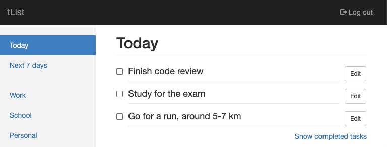

# tList

tList is a simple online to-do list written mostly in Java.



## A running demo

If you just wish to see it in action, you can access the application at https://tlist.herokuapp.com. You may use the credentials ```user@example.com``` and ```pwd```.

## Usage

If you have [Docker](https://docker.com) installed, you can spin up a local development environment with just a few lines. First, build the services (```db``` and ```app```) with the command

```shell
docker-compose build
```

If you are not familiar with Docker, this builds a Docker image for each service. Docker images are similar to virtual machine images, but they are more lightweight.

Second, start up the services with the command

```shell
docker-compose up
```

This provisions a database server and starts an embedded Tomcat server running the application.

When the database server starts for the first time, it creates a database for the application and creates the necessary tables. It also adds one user to the database: ```user@example.com``` with the password ```pwd```. If you wish, you may remove this user by accessing the database manually.

If you wish to access the database, you can open a psql shell with the command

```shell
docker-compose run db psql -h db -U postgres
```

The default password is ```secret```. Please recognize that this a local setup, which should never be exposed to the internet. The application expects the data to be in the default database named ```postgres```. You may wish to look at the directory [sql/](sql/) for some examples.

And that's it! The service should be available at http://localhost:8080.

## License

[MIT](LICENSE)
